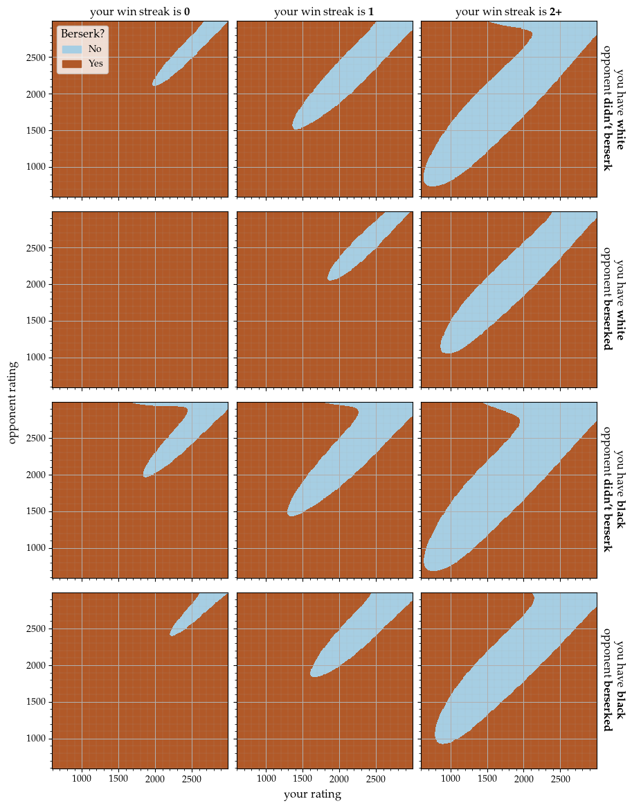

# When should you berserk in a lichess arena tournament game?

## 1+0 arena tournament

## 3+0 arena tournament

## Explanation
For details on how I arrived at the above plots, including more plots and exposition, see [markdown/1_analysis.md](markdown/1_analysis.md) and [markdown/3_analysis.md](markdown/3_analysis.md) for the 1+0 and 3+0 cases, respectively. These both use the plots generated by [analysis.ipynb](analysis.ipynb), where you can find the actual code.
## Downloading and processing the data
I downloaded all standard rated games in the [lichess database](database.lichess.org) from April 2017 to December 2021. All of the PGNs from April 2017 on have `%clk` tags, which allows one to determine whether one or both players berserked in any given tournament game by comparing each side's first-move clock time with the time control. The downloading was done in about 16 hours using `$ wget -i downloads.txt`, where `downloads.txt` was a text file containing the relevant URLs, like lichess provides [here](https://database.lichess.org/standard/list.txt). This amounted to 715 GB of compressed files containing about 2.75 billion games. Next, I used [rust-pgn-reader](https://github.com/niklasf/rust-pgn-reader) together with [rayon](https://github.com/rayon-rs/rayon) to process in parallel the `.pgn.bz2` files into CSVs (3 GB in total) containg the player ratings, berserk info, and result for every tournament game with a time control of 1+0 (71 million games) or 3+0 (99 million games). The rust code is in a seperate repository, [pgn2csv](https://github.com/jmviz/pgn2csv). This was quite fast compared to other tools like `python-chess`; the processing took about 7.5 hours in total, which comes out to about 353 million games per hour, or 96 GB/h or 26 MB/s. Of course this will depend on hardware (this was done with an i9-9900K on a wd blue sn550). 
## Acknowledgements
Thanks to the lichess developers for all of their work, in particular for making the lichess database free and accessible. Thanks to [niklasf](https://github.com/niklasf) for `rust-pgn-reader`. 